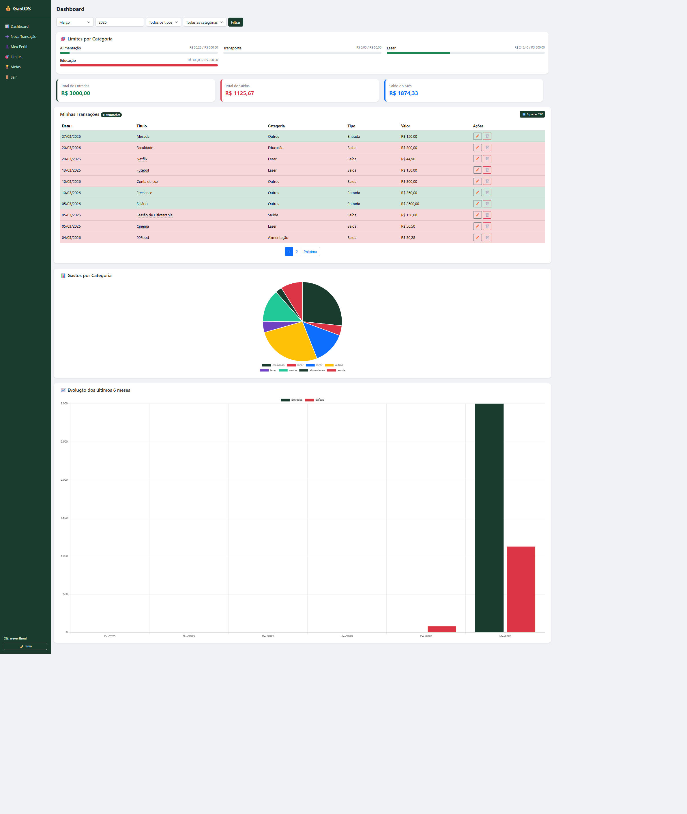
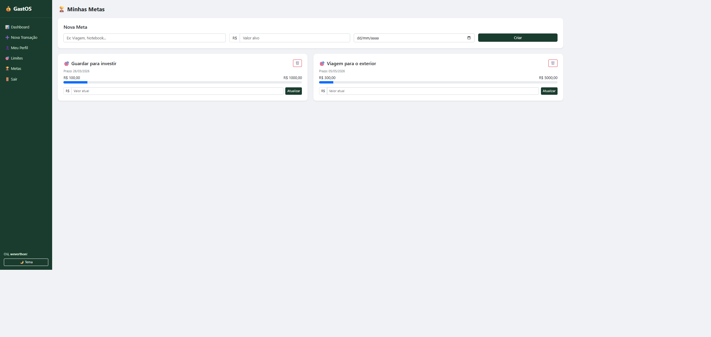
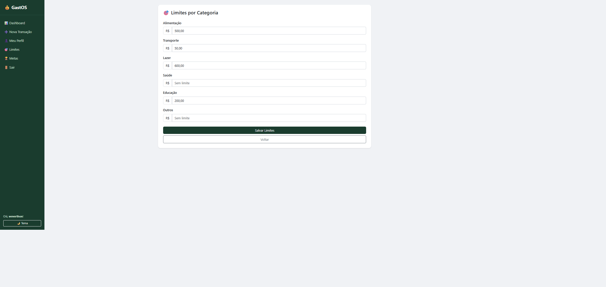

# 💰 GastOS — Sistema de Controle Financeiro Pessoal

GastOS é uma aplicação web de controle financeiro pessoal desenvolvida com **Python** e **Django**. O projeto permite registrar receitas e despesas, acompanhar o saldo mensal, definir limites de gastos por categoria, criar metas financeiras e visualizar tudo em um dashboard moderno e completo.

## 🚀 Funcionalidades

- ✅ Cadastro e autenticação de usuários
- ✅ Registro de receitas e despesas com categorias
- ✅ Dashboard com resumo financeiro mensal
- ✅ Filtros por mês, tipo e categoria
- ✅ Gráfico de gastos por categoria (rosca, com total no centro)
- ✅ Gráfico de evolução dos últimos 6 meses (barras)
- ✅ Planejamento mensal com barras de progresso por categoria
- ✅ Limites de gastos por categoria com alertas automáticos
- ✅ Metas financeiras com barra de progresso
- ✅ Exportar transações para CSV
- ✅ Ordenação da tabela por data, título e valor
- ✅ Tema claro/escuro
- ✅ Página de perfil com troca de senha
- ✅ Landing page

## 🛠️ Tecnologias utilizadas

- Python 3.12
- Django 6.0
- PostgreSQL (produção) / SQLite (desenvolvimento)
- Bootstrap 5
- Chart.js
- HTML e CSS

## 🌐 Acesse o projeto

👉 [https://gastos-k4in.onrender.com](https://gastos-k4in.onrender.com)

## 📸 Screenshots

### Landing Page


### Dashboard


### Metas


### Limites


## 📌 Status do projeto

🚀 Em desenvolvimento ativo

## ⚙️ Como rodar o projeto localmente

**1. Clone o repositório:**
```bash
git clone https://github.com/weverthondev/gastos.git
cd gastos
```

**2. Crie e ative o ambiente virtual:**
```bash
python -m venv venv
venv\Scripts\activate  # Windows
source venv/bin/activate  # Linux/Mac
```

**3. Instale as dependências:**
```bash
pip install -r requirements.txt
```

**4. Configure o arquivo `.env`** com base no `.env.example`

**5. Rode as migrações:**
```bash
python manage.py migrate
```

**6. Crie um superusuário (opcional):**
```bash
python manage.py createsuperuser
```

**7. Inicie o servidor:**
```bash
python manage.py runserver
```

**8. Acesse no navegador:**
http://127.0.0.1:8000

## 👨‍💻 Autor

Feito com 💚 por [Weverthon Alves](https://www.linkedin.com/in/weverthon-alves/)

## 📄 Licença

Este projeto está sob a licença MIT.